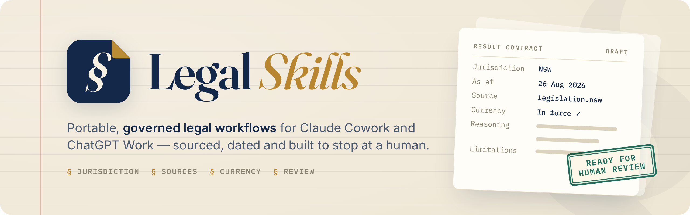

<picture>
  <source media="(prefers-color-scheme: dark)" srcset="docs/assets/legal-skills-banner-dark.png">
  
</picture>

<p align="center">
  <a href="https://github.com/l0cka/legal-skills/actions/workflows/ci.yml"></a>
  <a href="LICENSE"></a>
  <!-- generated:badges -->
  
  
  
<!-- end:badges -->
</p>

# Legal Skills

Ready-made legal workflows for your AI assistant. Install them once and
Claude (Cowork or Claude Code) or ChatGPT (Work or Codex) can check
Australian citations, map privacy and AML/CTF obligations, compute candidate
court deadlines, build chronologies and more, always in a way that states
its sources and leaves the final call to a person.

Free and open source (MIT).

## What's included

<!-- generated:counts -->
The marketplace contains eleven plugins and sixty-one skills:
<!-- end:counts -->

<!-- generated:plugin-table -->
| Plugin | Skills | Description | Law checked |
| --- | :---: | --- | :---: |
| [**Australian AI Governance**](plugins/australian-ai-governance/README.md) | 6 | Maps the AI rules and guidance that apply to an Australian organisation. Shows which items are law and which are only guidance. | 2026-08-26 |
| [**Australian AML/CTF**](plugins/australian-aml-ctf/README.md) | 5 | Finds the AML/CTF obligations of an Australian legal practice under the tranche 2 reforms. A person must approve each report and decision. | 2026-08-26 |
| [**Australian Corporations Governance**](plugins/australian-corporations-governance/README.md) | 5 | Helps govern an Australian company under the Corporations Act. Prepares board records and reviews for human approval. | 2026-08-26 |
| [**Australian Employment & Fair Work**](plugins/australian-employment-fair-work/README.md) | 5 | Maps the Fair Work Act, NES, award and agreement layers for an employment arrangement and issue-spots termination and policy exposure. A lawyer decides every conclusion. | 2026-08-26 |
| [**Australian Estate Planning**](plugins/australian-estate-planning/README.md) | 3 | Prepares solicitor-review drafts from approved NSW, Victorian and Queensland estate planning precedents. | 2026-08-26 |
| [**Australian Legal Research**](plugins/australian-legal-research/README.md) | 16 | Checks Australian legislation and case citations against the official publishers. Writes and reviews AGLC4 citations. | 2026-08-26 |
| [**Australian Litigation Deadlines**](plugins/australian-litigation-deadlines/README.md) | 6 | Maps limitation periods and computes candidate court deadlines. A lawyer must confirm each date. | 2026-08-26 |
| [**Australian Privacy & Cybersecurity**](plugins/australian-privacy-cybersecurity/README.md) | 8 | Maps the Australian privacy and cyber rules that can apply to a set of facts, a data breach or an AI use case. | 2026-08-26 |
| [**Legal Evidence Workflows**](plugins/legal-evidence-workflows/README.md) | 4 | Builds source-linked Word document indexes, chronologies, privilege logs and inconsistency maps from supplied matter documents without deciding credibility, privilege or merits. | 2026-08-26 |
| [**Legal Triage**](plugins/legal-triage/README.md) | 2 | Helps community legal centre staff record and triage legal enquiries under an approved profile. | 2026-08-26 |
| [**Legal Workflow Router**](plugins/legal-workflow-router/README.md) | 1 | Maps a fact pattern to the Legal Skills plugins and skills it engages, in order, with the human decision points named. | 2026-08-26 |
<!-- end:plugin-table -->

"Law checked" is the date each plugin's sources were last reviewed against
the law. Most plugins cover Australian law.

## Install

### The easy way: ask your assistant

Paste this into Claude or ChatGPT (any version that can manage plugins):

<!-- generated:install-agent -->
```text
Add the plugin marketplace `l0cka/legal-skills` and install all eleven of
its plugins (user scope if supported). Verify the plugins are available
and report the result.
```
<!-- end:install-agent -->

Claude Cowork users can instead add `l0cka/legal-skills` from the personal
plugin marketplace. ChatGPT Work availability depends on your plan and
workspace plugin settings.

### From a terminal

<details>
<summary><b>Claude Code</b></summary>

<!-- generated:install-claude -->
```bash
claude plugin marketplace add l0cka/legal-skills
claude plugin install australian-ai-governance@legal-skills --scope user
claude plugin install australian-aml-ctf@legal-skills --scope user
claude plugin install australian-corporations-governance@legal-skills --scope user
claude plugin install australian-employment-fair-work@legal-skills --scope user
claude plugin install australian-estate-planning@legal-skills --scope user
claude plugin install australian-legal-research@legal-skills --scope user
claude plugin install australian-litigation-deadlines@legal-skills --scope user
claude plugin install australian-privacy-cybersecurity@legal-skills --scope user
claude plugin install legal-evidence-workflows@legal-skills --scope user
claude plugin install legal-triage@legal-skills --scope user
claude plugin install legal-workflow-router@legal-skills --scope user
```
<!-- end:install-claude -->

</details>

<details>
<summary><b>Codex</b></summary>

<!-- generated:install-codex -->
```bash
codex plugin marketplace add l0cka/legal-skills
codex plugin add australian-ai-governance@legal-skills
codex plugin add australian-aml-ctf@legal-skills
codex plugin add australian-corporations-governance@legal-skills
codex plugin add australian-employment-fair-work@legal-skills
codex plugin add australian-estate-planning@legal-skills
codex plugin add australian-legal-research@legal-skills
codex plugin add australian-litigation-deadlines@legal-skills
codex plugin add australian-privacy-cybersecurity@legal-skills
codex plugin add legal-evidence-workflows@legal-skills
codex plugin add legal-triage@legal-skills
codex plugin add legal-workflow-router@legal-skills
```
<!-- end:install-codex -->

</details>

You only need the plugins you'll use. Each command installs one plugin.

### Everything at once (`.agents`)

`legal-skills-all` bundles every skill from every plugin into one plugin,
listed in the `.agents` marketplace for Codex and ChatGPT Work. You can also
copy it straight into an `.agents` directory. Install the bundle or the
individual plugins, not both. See
[bundles/legal-skills-all](bundles/legal-skills-all/README.md).

<!-- generated:install-bundle -->
```bash
# Codex or ChatGPT Work: one plugin from the .agents marketplace
codex plugin marketplace add l0cka/legal-skills
codex plugin add legal-skills-all@legal-skills

# Or copy the skills straight into an .agents directory
# (~/.agents for your user, or .agents at a project root)
git clone --depth 1 https://github.com/l0cka/legal-skills.git
mkdir -p ~/.agents
cp -R legal-skills/bundles/legal-skills-all/skills legal-skills/bundles/legal-skills-all/references ~/.agents/
```
<!-- end:install-bundle -->

## Before you rely on it

- **A person stays in charge.** Every plugin prepares work for a lawyer or
  other qualified person to check and approve. None of them gives legal
  advice or replaces professional judgment.
- **Sources are shown.** Outputs state the jurisdiction, the sources used,
  how current they are, and any assumptions.
- **Leads are not authority.** Search results and secondary material are
  flagged as leads; legal propositions rely on primary or authoritative
  sources.
- **No confidential content ships here.** The skills contain no client,
  matter or privileged information. Take care with what you share with your
  assistant under your own firm's policies.

## Benchmarks

We measure how answers change with and without the plugins on answer-keyed
and rubric-scored Australian legal tasks. See
[benchmarks/README.md](benchmarks/README.md) for the method.

<!-- benchmarks:start -->
_No benchmark run recorded yet._
<!-- benchmarks:end -->

## Contributing

Contributions are welcome. Start with [CONTRIBUTING.md](CONTRIBUTING.md),
then see [docs/adding-a-plugin.md](docs/adding-a-plugin.md) and
[docs/architecture.md](docs/architecture.md) for how the repository fits
together. [CHANGELOG.md](CHANGELOG.md) records what has changed.

## Licence

MIT. See [LICENSE](LICENSE).
